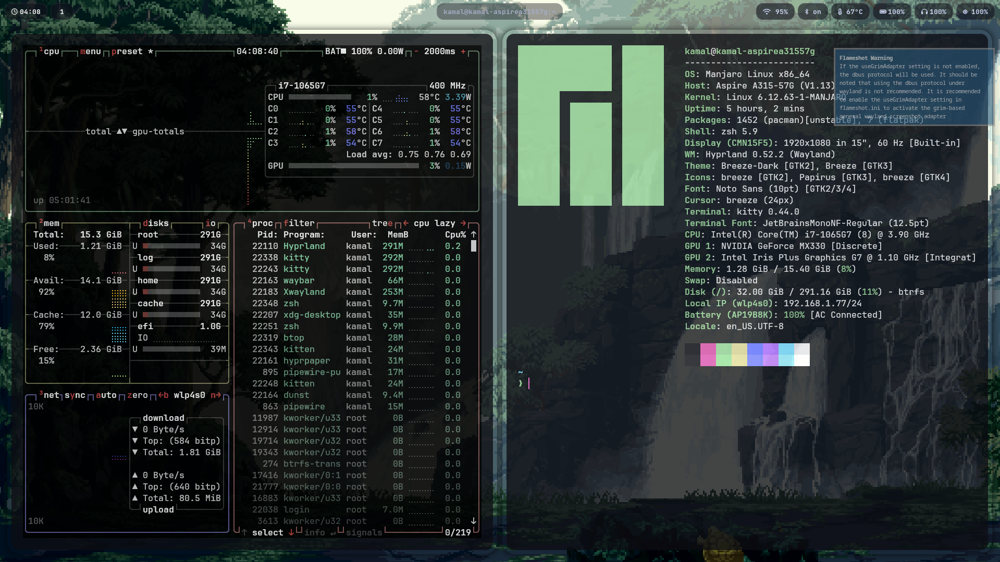

# Hyprland Dotfiles — My Manjaro Linux Setup 🧊

Personal dotfiles and configuration for my **Manjaro + Hyprland** desktop setup.  
Minimal, productive and keyboard-focused workflow with aesthetic looks.

> ⚠️ Works best on **Wayland** + **Hyprland** (Arch/Manjaro based systems)

---

## 🖼️ Screenshots

### Full Setup
<p align="center">
  
</p>

## ✨ Features

- Hyprland tiling window manager
- Waybar status bar with custom styling
- Kitty terminal with transparency + powerline fonts
- Zsh with aliases & clean prompt
- Fast install script for quick system bootstrap
- Dotfiles auto-backup before applying configs
- Wallpapers organized as external links 🎨

---

## 📂 Directory Structure
```
hyprland-dotfiles
│
├── dotfiles
│ ├── hypr/ # Hyprland, hyprpaper, hyprlock configs
│ ├── kitty/ # Kitty terminal
│ ├── waybar/ # Status bar
│ └── zsh/ # Shell configuration
│
├── wallpapers # links.txt holding wallpaper URLs
├── screenshots # setup showcase images
└── scripts # install & automation
```

---

## 🚀 Installation

```bash
git clone git@github.com:KamalEhedli/hyprland-dotfiles.git
cd hyprland-dotfiles
chmod +x scripts/install.sh
./scripts/install.sh
```
💡 After install:
hyprctl dispatch restart to reload Hyprland


🎨 Wallpapers

All wallpapers used in this setup are listed here:
👉 wallpapers/links.txt


🧰 Tools & Dependencies
Component  Package
WM	   hyprland
Wallpaper  hyprpaper
Terminal   kitty
Shell	   zsh
Bar 	   waybar
